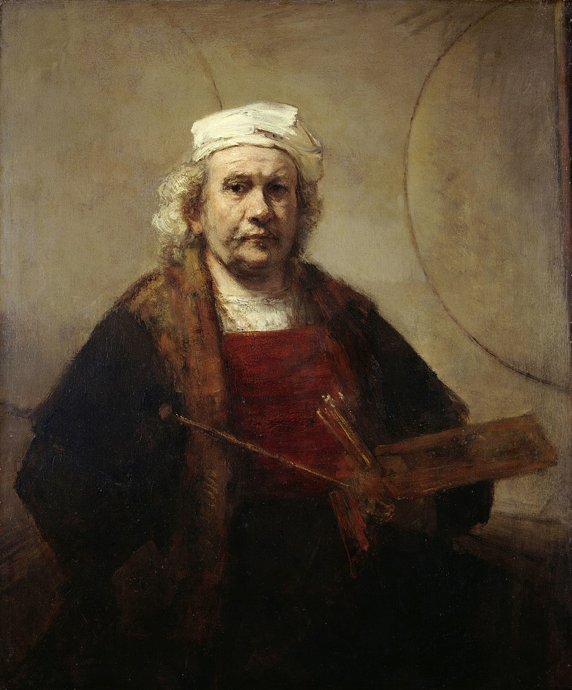

# Curriculum Vitae

*"Self-Portrait with Two Circles" (c. 1665–1669) by Rembrandt van Rijn — [Wikipedia](https://en.wikipedia.org/wiki/Self-Portrait_with_Two_Circles)*

Pedro Delfino's resume.

**Note:** The PDF in this repository is outdated. For up-to-date information, see the links below.

## About

- **Applied Mathematics** (B.Sc.) -- EMAp, Fundacao Getulio Vargas (FGV)
- **Law** (LL.B.) -- FGV DIREITO RIO
- Dual-degree graduate with experience spanning software development, technical writing, and legal analysis.

## Links

- [LinkedIn](https://www.linkedin.com/in/pedro-delfino/) -- most up-to-date professional profile
- [pedrodelfino.com](https://pedrodelfino.com) -- personal blog (English)
- [pdelfino.com.br](https://www.pdelfino.com.br) -- personal blog (Portuguese)
- [GitHub](https://github.com/pdelfino)
